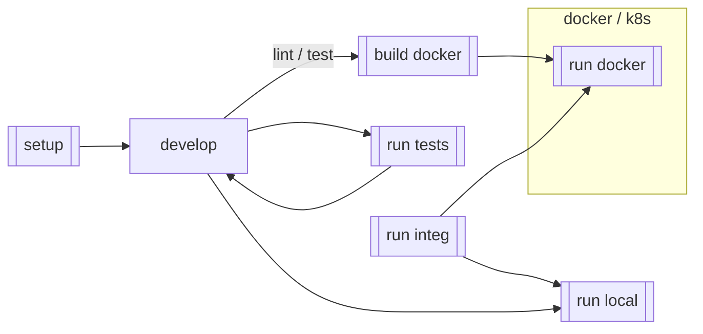

# CONTRIBUTING

> **_NOTE:_**
> For compliance reasons, all pull requests must be submitted with a Jira ID as a part of the pull
> request.
>
> You should include the Jira ID near the beginning of the title for better readability.
>
> For example:
> `[XX-1234]: add statement to CONTRIBUTING.md about including Jira IDs in PR titles`
>
> If there is more than one relevant ticket, include all associated Jira IDs.
>
> For example:
> `[WM-1997] [WM-2002] [WM-2005]: fix for many bugs with the same root cause`
>

This section describes the steps necessary to finish setting up and contributing to this repo. If
you would like more information about the design and reasons "why" this repo is structured like it
is, please continue reading in the [DESIGN.md](./DESIGN.md)-document located in this directory.

This document assumes you've completed the steps located
in [Environment setup](./README.md#environment-setup) for how to `setup` and `run` the service.
If you haven't completed those steps yet, please go back and make sure you can successfully run the
service from your device.

If you have questions or run into issues, please see
the [Frequently Asked Questions](#frequently-asked-questions-faq) section in this document. If your
question is not answered there, additional help resources can be found at the bottom of this
document.

## Developer convenience scripts

To help accelerate interacting with this repo,
there are a series of scripts available in the `./scripts` directory.

The double walled boxes represent scripts that are available in the `./scripts` directory.
Each script is outfitted with a help and usage guide, and the scripts are tied into the build
process to ensure they continue to run successfully. For more information about the scripts, please
see the [./scripts/README.md](./scripts/README.md).

## Developing

### Setting up IntelliJ IDEA (2023.3.4)

With IntelliJ IDEA open, perform the following steps to set up your IDE:

1. Select `File` => `Open ...`
2. Select the root directory of this repo on your local filesystem  
   (e.g. `~/workbench/terra-java-project-template`)
3. Click `Open`

IntelliJ will detect that this is a `gradle`-based project and start compiling your repo.

## Frequently Asked Questions (FAQ)

(build out this section based on questions asked of the team)

## Additional questions

Doug Voet created this repository, based in part on other Terra projects
like [Workspace data service](https://github.com/DataBiosphere/terra-workspace-data-service)
and [Terra data catalog](https://github.com/DataBiosphere/terra-data-catalog).

Additional questions can be directed to
the [#dsp-engineering](https://broadinstitute.slack.com/archives/C1C22V6FN/).
