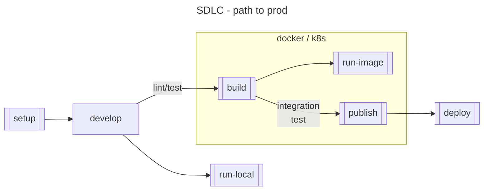

# CONTRIBUTING

> **_NOTE:_**
> For compliance reasons, all pull requests must be submitted with a Jira ID as a part of the pull
> request.
>
> You should include the Jira ID near the beginning of the title for better readability.
>
> For example:
> `[XX-1234]: add statement to CONTRIBUTING.md about including Jira IDs in PR titles`
>
> If there is more than one relevant ticket, include all associated Jira IDs.
>
> For example:
> `[WM-1997] [WM-2002] [WM-2005]: fix for many bugs with the same root cause`
>

## Developer convenience scripts

To help accelerate interacting with this repo,
there are a series of scripts available in the `./bin` directory.

Please refer to the [README.md in that directory](./bin/README.md)
for more information on those scripts.

## Developing

### Setting up IntelliJ IDEA

Once you have

## Frequently Asked Questions (FAQ)

### Additional questions

Doug Voet created this repository, based in part on other Terra projects
like [Workspace data service](https://github.com/DataBiosphere/terra-workspace-data-service)
and [Terra data catalog](https://github.com/DataBiosphere/terra-data-catalog).

Additional questions can be directed to
the [#dsp-engineering](https://broadinstitute.slack.com/archives/C1C22V6FN/).
